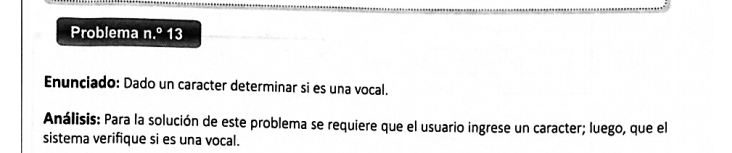

# CURSOS DE HTML CSS JAVASCRIPT
<<<<<<< HEAD

###### Para aprender más y ver los diferentes propuestos ingresa al siguiente link
<a href="https://classroom.google.com/u/0/w/MjA1MDQ4MjYxOTEx/t/all">Ir a classroom</a>


## **Estructuras**
=======
###### Aprenderemos diseño web, para principiantes
_______

## JavaScript

tipos de datos
===
>>>>>>> markdown
1. Ejercico1

- *Ejercico2*
- **Ejecicio3**
- _Ejercicio04_
- __Ejercicio04__
-  ~~Ejercicio04~~
-  ~Ejercicio04~

<<<<<<< HEAD


=======
<a href="https:/youtube.com">Ir a youtube</a>

[link interno](index.html)

imagenes
====


```JavaScript

const palabra=null;
```
```HTML
<a>link</a>
```
```CSS
body{
    margin:0;
}
```
>>>>>>> markdown
<!-- 
hola que tal como esafs
 -->

 | id | Nombre |
 |----|--------|
 |001 | Marco  |
<<<<<<< HEAD


***
> ### **Problema 13**


1. [Código HMTL](JAVASCRIPT\2EstructuraSelectiveSimpleYdoble\index.html)
2. [Código CSS](JAVASCRIPT\2EstructuraSelectiveSimpleYdoble\css\styles.css)
3. [Código JavaScript](JAVASCRIPT\2EstructuraSelectiveSimpleYdoble\js\problema_13.js)

## **Estructura repetitiva**


=======
 
***

>Autor: Marco Yanchapanta
>>>>>>> markdown


